# 🌌 Sathiya Priyan
### AI Engineer • Backend Developer • Building Autonomous Agentic Systems

  
  
  
  
  

---

## ⚡ Executive Summary

I am an Integrated M.Tech Computer Science student at **SSN College of Engineering** passionate about bridging the gap between cutting-edge Artificial Intelligence research and resilient, scalable software systems.

My core focus lies in architecting **Agentic AI systems, enterprise RAG pipelines, LLM-orchestrated autonomous agents, and high-performance microservices**. I thrive on tackling complex engineering challenges—from prompt engineering and semantic retrieval to distributed backends and real-time data pipelines.

---

## 🎮 Developer Mode: SHOOT • CODE • REPEAT

  
<i>🕹️ Space Defense Subsystem: Neutralizing bugs, race conditions, and latency in real-time.</i>

  

---

## 🎯 Engineering & Research Focus

<table>
  <tr>
    <td width="50%" valign="top">
      <h3>🤖 Agentic Systems & LLMs</h3>
      <ul>
        <li>Autonomous multi-agent architectures with <b>LangGraph & LangChain</b></li>
        <li>Hybrid & Dense <b>RAG Pipelines</b> with semantic vector search</li>
        <li>Fine-tuning & prompting with <b>OpenAI, Gemini & Hugging Face Transformers</b></li>
        <li>NLP workflows with <b>spaCy, Sentence-Transformers & Tokenizers</b></li>
      </ul>
    </td>
    <td width="50%" valign="top">
      <h3>⚙️ Scalable Backend Engineering</h3>
      <ul>
        <li>Asynchronous RESTful APIs with <b>FastAPI & Flask</b></li>
        <li>Relational & NoSQL persistence with <b>PostgreSQL, SQLAlchemy & MongoDB</b></li>
        <li>Containerized microservices using <b>Docker</b></li>
        <li>Clean architectural patterns: Domain-Driven Design & Repository Pattern</li>
      </ul>
    </td>
  </tr>
</table>

---

## 💻 Tech Stack & Toolkit

### 💻 Programming Languages

### 🤖 AI, Machine Learning & Agentic Frameworks

### ⚙️ Backend & API Development

### 🎨 Frontend & Mobile

### 🗄️ Databases & Storage

### ☁️ Cloud, DevOps & Tools

### 🚀 Currently Mastering

---

## 🛠️ Featured Projects & Systems

<table>
  <tr>
    <td width="50%" valign="top">
      <h3>🧠 <a href="https://github.com/SATHIYA-26/RAG-ConvMind">RAG-ConvMind</a></h3>
      
Conversational Retrieval-Augmented Generation system designed for context-aware multi-turn dialogue, dense document retrieval, and hallucination reduction.

      

        
        
        
        
      

      <a href="https://github.com/SATHIYA-26/RAG-ConvMind"><b>View Repository ➔</b></a>
    </td>
    <td width="50%" valign="top">
      <h3>⚡ <a href="https://github.com/SATHIYA-26/RAG-Intelligent">RAG-Intelligent</a></h3>
      
Intelligent document search and question-answering pipeline utilizing dense semantic vector embeddings, ranking models, and grounded LLM synthesis.

      

        
        
        
        
      

      <a href="https://github.com/SATHIYA-26/RAG-Intelligent"><b>View Repository ➔</b></a>
    </td>
  </tr>
  <tr>
    <td width="50%" valign="top">
      <h3>🤖 <a href="https://github.com/SATHIYA-26/AI-Based-Product-Decision-System">AI-Based Product Decision System</a></h3>
      
Multi-agent AI platform analyzing market sentiment, feature evaluation metrics, and user feedback data to generate automated product roadmap recommendations.

      

        
        
        
        
      

      <a href="https://github.com/SATHIYA-26/AI-Based-Product-Decision-System"><b>View Repository ➔</b></a>
    </td>
    <td width="50%" valign="top">
      <h3>📍 <a href="https://github.com/SATHIYA-26/Automute-App">AutoMute App</a></h3>
      
Smart mobile utility engineered in Flutter that automatically triggers geofence boundaries to adjust and silence device ringer profiles based on geolocation.

      

        
        
        
        
      

      <a href="https://github.com/SATHIYA-26/Automute-App"><b>View Repository ➔</b></a>
    </td>
  </tr>
</table>

---

## 📊 GitHub Analytics & Performance

<!-- Fast, High-Availability Tokyo Night Stats Cards -->

  

  
  

<!-- Activity Graph -->

  

---

## 🐍 Contribution Stream

  

---

## 💬 Let's Connect & Build Together

Whether you're interested in collaborating on Agentic AI, exploring RAG systems, discussing backend scalability, or looking for an engineer for your team, I'd love to connect!

  
  
  
  

 

`

 

⭐️ *Crafted with precision by [SATHIYA-26](https://github.com/SATHIYA-26) • If you find my projects helpful, consider starring them!*

